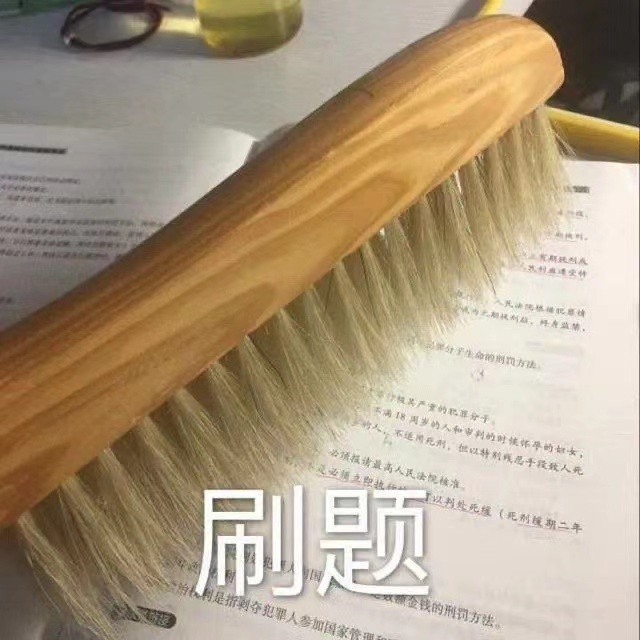

# 😍Yan的前端基础学习笔记

# 🤭前言

**~~这个文档~~** 
**不是** 
 
**这个笔记是我在B站观看[pink老师的教学视频](https://www.bilibili.com/video/BV14J4114768?p=1)而做的笔记**

**目的是为了我自己更加的了解和熟悉，二者是更好的去找自己不会的点** 

**当然，pink老师的评论区也有很多小伙伴把自己做的笔记分享了出来**

**并不是他（她）们写的不好**

**只是说自己做的笔记相对来说会更好理解，毕竟每个人做笔记的思路都不一样** 

**关于这个笔记呢，你觉得我写的不错的话，希望您点击右下角的聊天窗口鼓励我，如果你觉得写的不好的话呢。。。** 
<hongcu>那你自己写好了</hongcu> 

# 😜其他

- [**笔记更新日志**](/RIZHI?id=💻更新日志)
- [**Emmet语法**](/Emmet?id=emmet语法)
- [**一个小工具的使用snipaste**](/CSS基础/DIERTIAN?id=_26-一个小工具的使用-snipaste)

# 🧐查询文档

**因为这只是个笔记文档，不一定全都有**

**而且经常查阅文档是一个非常好的学习习惯**

> **下面是推荐的网址：**
> - **百度：https://www.baidu.com**
> - **W3C：https://www.w3school.com.cn/**
> - **MDN：https://developer.mozilla.org/**

# 🤗联系我

> **这里推荐添加QQ群，因为企业微信和邮件不经常看**

***QQ群：[883600025](https://qm.qq.com/cgi-bin/qm/qr?k=geWABzFfMPcFvHQQ4UlZFGji3DSYBQ2p&authKey=DTS5qy7SsNRpmSpSS+3dbX12r7bd/9iZYSJvV4yoZHsz+d8Dpt0bs5dRLK/Y+pdy&noverify=0)***

***企业微信：[点我](https://work.weixin.qq.com/wework_admin/user/h5/qqmail_user_card/vc32c1cd731861b088)***

***邮件：yan@yjf.vin***

***还有网页右边的聊天悬浮窗也可以联系我哦👉***
